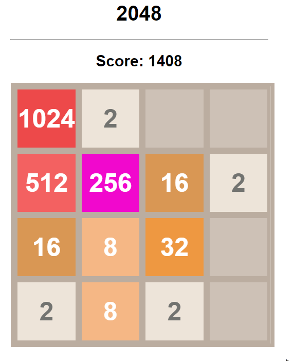

# Introduction
This program includes a simple 2048 game and a AI solver written in JavaScript.

## Strategy Explanation
This solver deploys a DFS method with below heuristic metrics construction.

metrics = $\theta_1E_1 + \theta_2E_2 + \theta_3E_3 + \theta_4E_4$, where \
$E_1$ is the Smoothness of the matrix, $$\nabla a_{ij} = \begin{pmatrix} a_{i-1, j} - a_{ij}\\ a_{i-1, j} - a_{ij}\\ a_{i-1, j} - a_{ij}\\ a_{i-1, j} - a_{ij} \\ \end{pmatrix} _\infty $$\
$E_2$ is the Monotonicity of the matrix, \
$E_3$ is the empty cells on the board, \
$E_4$ is the maximum value. 

Given board $A=[a_{i_j}]$, where $a_{ij} = [0, 2^k, \dots, 2^11]$, $k = 1, 2, \dots 11$, $i\in[0, 3]$, $j\in[0, 3]$. 

$E_1$ can be obtained by looping each element and calculating the differences comparing with the four edging points. \
$E_2$ can be obtained by comparing each element and its neighbor in row or in column and choosing the max in either of the two directions. 
$E_3$ is the quantity when $a_{ij} = 0$. \
$E_4 = \displaystyle\max_{i,j}a_{ij} $

## Solver Autorun
Example of the Autorun. \

